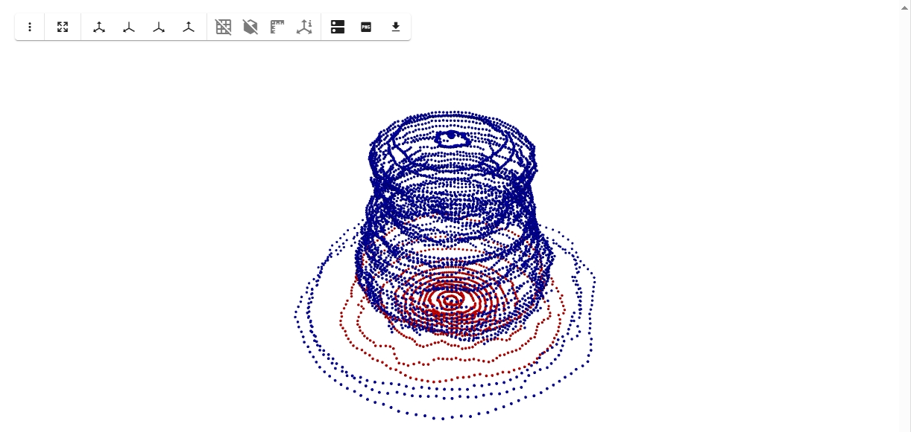
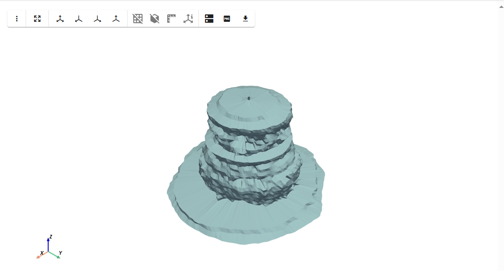

# Mesh Example


```python
import saltpy
from saltpy.agapito import SonarPy as sp

import pyvista as pv
import geopandas as gpd
from stl import mesh as stl_mesh
import numpy as np
import pandas as pd
```

## Load and investigate gdf

At depth 580 we have an irregular count and non horizontal inclination.


```python
gdf = gpd.read_file("01_200708.gpkg")
```


```python
# group by depth and calculate summary statistics
summary = gdf.groupby("depth").agg(
    mInc_min=("mInc", "min"),
    mInc_max=("mInc", "max"),
    count=("mInc", "count")
).reset_index()

# Print results
for _, row in summary.iterrows():
    print(f"Depth: {row['depth']}, mInc Min: {row['mInc_min']:.2f}, Max: {row['mInc_max']:.2f}, Count: {int(row['count'])}")
```

    Depth: 514.0, mInc Min: 90.00, Max: 90.00, Count: 128
    Depth: 516.0, mInc Min: 90.00, Max: 90.00, Count: 128
    Depth: 517.0, mInc Min: 90.00, Max: 90.00, Count: 128
    Depth: 518.0, mInc Min: 90.00, Max: 90.00, Count: 128
    Depth: 520.0, mInc Min: 90.00, Max: 90.00, Count: 128
    Depth: 522.0, mInc Min: 90.00, Max: 90.00, Count: 128
    Depth: 524.0, mInc Min: 90.00, Max: 90.00, Count: 128
    Depth: 526.0, mInc Min: 90.00, Max: 90.00, Count: 128
    Depth: 528.0, mInc Min: 90.00, Max: 90.00, Count: 128
    Depth: 530.0, mInc Min: 90.00, Max: 90.00, Count: 128
    Depth: 532.0, mInc Min: 90.00, Max: 90.00, Count: 128
    Depth: 534.0, mInc Min: 90.00, Max: 90.00, Count: 128
    Depth: 536.0, mInc Min: 90.00, Max: 90.00, Count: 128
    Depth: 538.0, mInc Min: 90.00, Max: 90.00, Count: 128
    Depth: 540.0, mInc Min: 90.00, Max: 90.00, Count: 128
    Depth: 542.0, mInc Min: 90.00, Max: 90.00, Count: 128
    Depth: 544.0, mInc Min: 90.00, Max: 90.00, Count: 128
    Depth: 546.0, mInc Min: 90.00, Max: 90.00, Count: 128
    Depth: 548.0, mInc Min: 90.00, Max: 90.00, Count: 128
    Depth: 550.0, mInc Min: 90.00, Max: 90.00, Count: 128
    Depth: 552.0, mInc Min: 90.00, Max: 90.00, Count: 128
    Depth: 554.0, mInc Min: 90.00, Max: 90.00, Count: 128
    Depth: 556.0, mInc Min: 90.00, Max: 90.00, Count: 128
    Depth: 558.0, mInc Min: 90.00, Max: 90.00, Count: 128
    Depth: 560.0, mInc Min: 90.00, Max: 90.00, Count: 128
    Depth: 562.0, mInc Min: 90.00, Max: 90.00, Count: 128
    Depth: 564.0, mInc Min: 90.00, Max: 90.00, Count: 128
    Depth: 566.0, mInc Min: 90.00, Max: 90.00, Count: 128
    Depth: 568.0, mInc Min: 90.00, Max: 90.00, Count: 128
    Depth: 570.0, mInc Min: 90.00, Max: 90.00, Count: 128
    Depth: 572.0, mInc Min: 90.00, Max: 90.00, Count: 128
    Depth: 574.0, mInc Min: 90.00, Max: 90.00, Count: 128
    Depth: 576.0, mInc Min: 90.00, Max: 90.00, Count: 128
    Depth: 578.0, mInc Min: 90.00, Max: 90.00, Count: 128
    Depth: 580.0, mInc Min: 90.00, Max: 179.00, Count: 1664
    Depth: 582.0, mInc Min: 90.00, Max: 90.00, Count: 128
    Depth: 584.0, mInc Min: 90.00, Max: 90.00, Count: 128
    Depth: 586.0, mInc Min: 90.00, Max: 90.00, Count: 128
    Depth: 588.0, mInc Min: 90.00, Max: 90.00, Count: 128
    Depth: 590.0, mInc Min: 90.00, Max: 90.00, Count: 128
    Depth: 592.0, mInc Min: 90.00, Max: 90.00, Count: 128
    Depth: 594.0, mInc Min: 90.00, Max: 90.00, Count: 128
    

## Explore point cloud with PyVista

The depth with tilted shots is highlighted in red.

```python
### irregular depth
d_irreg = 580

# get points
points = np.array([[pt.x, pt.y, pt.z] for pt in gdf.geometry])

# assign colors and sizes
colors = np.array([
    [255, 0, 0] if depth == d_irreg else
    [0, 0, 225]
    for depth in gdf["depth"]
], dtype=np.uint8)

# add attributes
point_cloud = pv.PolyData(points)
point_cloud["colors"] = colors

glyphs = point_cloud.glyph(geom=pv.Sphere(), orient=False)

# plot
plotter = pv.Plotter()
plotter.add_mesh(glyphs, scalars="colors", rgb=True)
plotter.show()
```




## Build inital arrays


```python
# tilted gdf
gdf_irr = gdf[(gdf["depth"] == d_irreg) & (gdf["mInc"] != 90)]

# horiz gdf
gdf_horiz = gdf[
    (gdf["depth"] != d_irreg) | ((gdf["depth"] == d_irreg) & (gdf["mInc"] == 90))
]

b_vertices, b_faces = sp.build_endcap(gdf_irr)
h_vertices, h_faces = sp.build_horizontal_shots(gdf_horiz)
```

    Grouped by 'depth' into 42 layers.
    

## Connect layers

Connect the horizontal shot mesh to the bottom mesh


```python
# find deepest horizontal layer
deepest_horiz_depth = gdf_horiz["depth"].max()
bottom_horiz_df = gdf_horiz[gdf_horiz["depth"] == deepest_horiz_depth]

# find shallowest inclination layer from tilted
shallowest_inc = gdf_irr["mInc"].abs().min()
shallowest_incl_df = gdf_irr[gdf_irr["mInc"].abs() == shallowest_inc].copy()

# build connecting layer
combined_df = pd.concat([bottom_horiz_df, shallowest_incl_df], ignore_index=True)
connect_vertices, connect_faces = sp.build_horizontal_shots(combined_df)
```
    Grouped by 'depth' into 2 layers.
## Plot Final Mesh


```python
sp.combine_mesh_parts(
    parts=[
        (h_vertices, h_faces),
    ],
    filename="full_cave_mesh.stl"
)

mesh = pv.read("full_cave_mesh.stl")
mesh.plot()
```

    Combined mesh saved to: full_cave_mesh.stl
    
