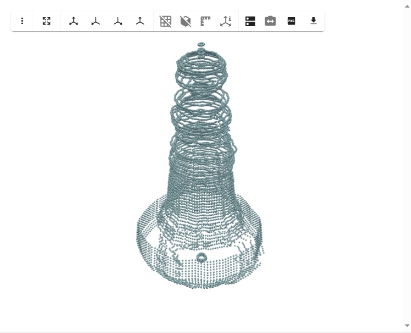
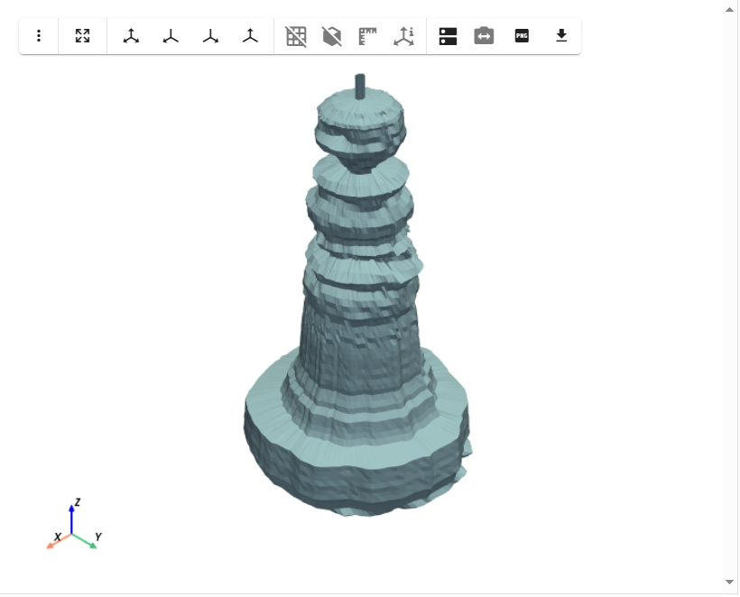

# Wireframe mesh simple EXAMPLE


```python
from stl import mesh as stl_mesh
import numpy as np
import pyvista as pv
import geopandas as gpd
import pandas as pd
from scipy.interpolate import griddata
from scipy.spatial import Delaunay
import fiona

from wireframe_functions import gdf_to_points_grid_from_rc, build_horizontal_shots, build_endcap, combine_mesh_parts
```

## Load and investigate gdf

This must be a file with only horizontal shots.


```python
gdf = gpd.read_file("02_200206.gpkg")
```


## Explore point cloud with PyVista


```python
# get points
points = np.array([[pt.x, pt.y, pt.z] for pt in gdf.geometry])

# build point cloud
point_cloud = pv.PolyData(points)
glyphs = point_cloud.glyph(geom=pv.Sphere(), orient=False)

# plot without RGB colors
plotter = pv.Plotter()
plotter.add_mesh(glyphs)
plotter.show()
```




## Build Mesh


```python
h_vertices, h_faces = build_horizontal_shots(gdf)
```

    Grouped by 'depth' into 82 layers.
    

## Plot Final Mesh


```python
combine_mesh_parts(
    parts=[
        (h_vertices, h_faces),
    ],
    filename="full_cave_mesh.stl"
)

mesh = pv.read("full_cave_mesh.stl")
mesh.plot()
```

    Combined mesh saved to: full_cave_mesh.stl
    


